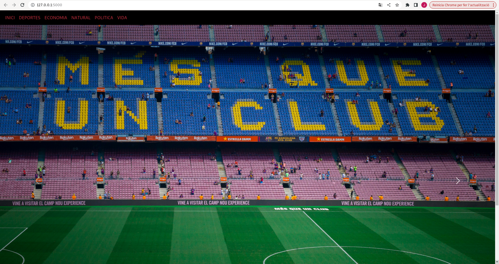
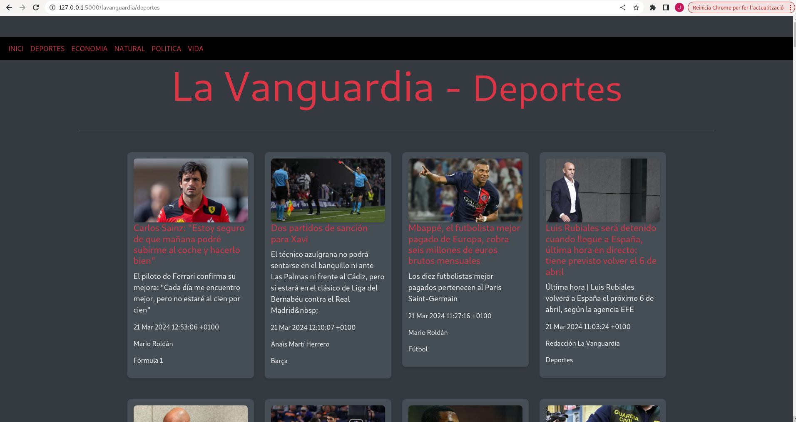

# Aplicació Flask-RSS PROJECTE UF3

## Introducció

La meva aplicació mostra el contingut de XMLs en format feed/rss utilitzant Flask i Bootstrap. Està dissenyada per mostrar les notícies del diari La Vanguardia.


### Creació de l'entorn virtual

Per treballar amb aquesta aplicació, hem fet servir un entorn virtual de Python. Aquí tens els passos per crear i activar un entorn virtual:

#### Linux

```bash
python3 -m venv .venv
source .venv/bin/activate
```

**Instal·lació de llibreries**
Un cop l'entorn virtual estigui activat, instal·la les llibreries necessàries executant:

```bash
pip install flask feedparser
```

**Desactivar l'entorn virtual**

Per sortir de l'entorn virtual, executa:

```bash
deactivate
```

**Executar l'aplicació**

Per iniciar l'aplicació Flask, primer assegura't que l'entorn virtual està activat i després executa el següent comandament des del terminal integrat de Visual Studio Code:

```bash
flask run --debug
```

Això iniciarà el servidor Flask. Obre un navegador i ves a http://127.0.0.1:5000/ per veure l'aplicació en acció.



**Aturar el servidor**

Per aturar el servidor Flask, prem CTRL + C al terminal integrat.

Nosaltres estem utilitzant la aplicacio de manera local però també es podria de manera remota.

**Mode local**

En aquest mode, primer has de descarregar els XMLs i guardar-los localment. Després, l'aplicació llegirà els XMLs des de la teva màquina.

**Recursos addicionals**

Informació sobre entorns virtuals en Python: [Python Virtual Environments](https://docs.python.org/es/3/library/venv.html)

Documentació de feedparser: [Feedparser Documentation](https://feedparser.readthedocs.io/en/latest/)

**Maquetació amb Bootstrap**

L'aplicació utilitza Bootstrap 5 per a la maquetació. Pots trobar més informació a:

[Bootstrap 5 Documentation](https://getbootstrap.com/docs/5.3/getting-started/introduction/)



